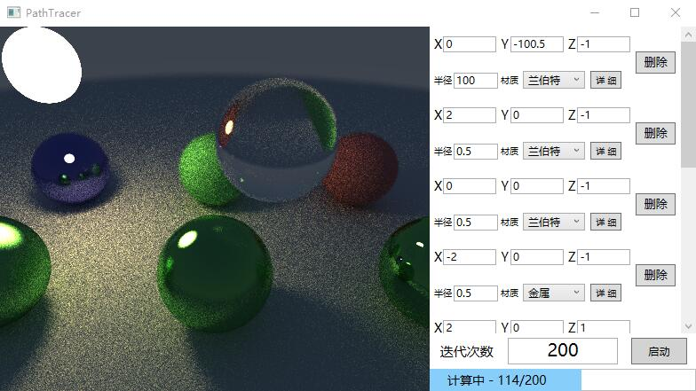
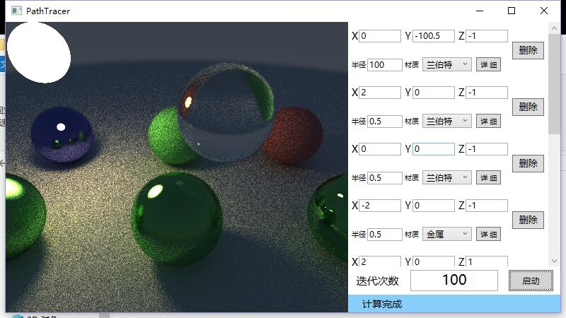

# Path Tracer 路径追踪渲染器 项目报告
1652718 郎润宣
1652772 肖    睿
1652676 袁    昊

[TOC]


## 简介
本项目实现了一个采用基本光线追踪渲染思想的光线追踪渲染器，通过完全由用户定义的场景进行光线追踪渲染效果的演示。
## 项目背景
**光线追踪**（Ray tracing）是三维计算机图形学中的特殊渲染算法，跟踪从眼睛发出的光线而不是光源发出的光线，通过这样一项技术生成编排好的场景的数学模型显现出来。这样得到的结果类似于光线投射与扫描线渲染方法的结果，但是这种方法有更好的光学效果，例如对于反射与折射有更准确的模拟效果，并且效率非常高，所以当追求高品质的效果时经常使用这种方法。在图形计算设备厂商英伟达的最新一代显卡技术RTX中，提供了一个单独的硬件来进行实时光线追踪渲染，以这种方式渲染的游戏场景能有相当惊艳的视觉效果。本项目基于光线追踪的算法思想，实现了一个渲染并展示自定义场景的基础的光线追踪渲染器。

## 算法
### 摄像机投影
将输出画面中的像素点映射到从摄像机视角发出的追踪光线。对于定义的摄像机 Camera，通过其GetRay()方法获取某一指定像素点的追踪路径。
```C#
public Ray GetRay(float s, float t, ref uint state)
{
	float3 rd = lensRadius * MathUtil.RandomInUnitDisk(ref state);
	float3 offset = u * rd.x + v * rd.y;
	return new Ray(origin + offset, float3.Normalize(lowerLeftCorner + s * horizontal + t * vertical - origin - offset));
}
```
追踪射线的位置由摄像机初始位置加上光圈半径内的随机项组成，方向由该射线所对应的像素位于投影面的位置决定。函数中的s和t变量为需要获取的追踪光路所对应像素点在屏幕位置以左下角为零点，相比于屏幕宽高的横纵比例。
### 迭代光线追踪

- **光线追踪**
- 程序中光线的追踪流程通过**TraceRow（）**来对每行像素点的路径光线进行多次追踪采样

```
float3 col = new float3(0, 0, 0);
					for (int s = 0; s < DO_SAMPLES_PER_PIXEL; s++)
					{
						float u = (x + MathUtil.RandomFloat01(ref state)) * invWidth;
						float v = (y + MathUtil.RandomFloat01(ref state)) * invHeight;
						Ray r = cam.GetRay(u, v, ref state);
						col += Trace(r, 0, ref rayCount, ref state);
					}
					col *= 1.0f / (float)DO_SAMPLES_PER_PIXEL;
```

- 每一个像素点的色彩通过对应的**Trace（）**计算返还散射出的Ray所承载的色彩值
- 在**Trace（）**追踪光线的过程中，先根据传入的Ray与场景中的Spheres检测是否碰撞，再根据结果来做出不同的着色操作，具体的碰撞检测过程参见之后的**碰撞检测**部分
  - 如果检测光线散射出去后与场景中物体发生碰撞，则会调用**Scatter（）**来对色彩值进行计算，并在碰撞点产生新射线的记录对应的衰变系数发散出去，并调用新的**Trace（）**进行迭代跟踪

```
if (depth < kMaxDepth && Scatter(ref mat, ref r, rec, out attenuation, out scattered, out lightE, ref inoutRayCount, ref state))
				{
					float3 temp = new float3(0,0,0);
					foreach (Ray ray in scattered)
						temp += Trace(ray, depth + 1, ref inoutRayCount, ref state, doMaterialE);
					return matE + lightE + attenuation * temp / scattered.Count;
				}
				else
				{
					return matE;
				}
```

- 如果光线没有碰撞到物体，则场背景景的返回色彩被采集

```
  * 	// sky

				float3 unitDir = r.dir;
				float t = 0.5f * (unitDir.y + 1.0f);
				return ((1.0f - t) * new float3(1.0f, 1.0f, 1.0f) + t * new float3(0.5f, 0.7f, 1.0f)) * 0.3f;
```

- **碰撞检测**
- 碰撞检测的结构为bool函数**HitWorld（）**返回HitSpheres的结果
  - HitSpheres中检测光线是否与场景中的物体发生碰撞，场景中的每一个物体都带有对应的id标号，被存储在s_SpheresSoA这个结构中
  - 如果光线与物体有碰撞，则会返回true与并附带对应物体的Id
  - 如果没有检测到光线与物体有产生碰撞，则HitWorld会根据返回的-1传false
  - HitSpheres函数中光与物体的检测是通过勾股定理相关来计算的

```
     float coX = centerX[i] - r.orig.x;
				float coY = centerY[i] - r.orig.y;
				float coZ = centerZ[i] - r.orig.z;
				float nb = coX * r.dir.x + coY * r.dir.y + coZ * r.dir.z;
				float c = coX * coX + coY * coY + coZ * coZ - sqRadius[i];
				float discr = nb * nb - c;
				if (discr > 0)
{...}

```

- 
- 当碰撞发生，并且光线在屏幕限定的范围内，Sc射线的信息以及碰撞点相关信息被记录at之后光散射线t信息提，并且的相关物体id也被返回

```
				if (discr > 0)
				{
					float discrSq = MathF.Sqrt(discr);
					
					float t = nb - discrSq;
					if (t <= tMin)
						t = nb + discrSq;

					if (t > tMin && t < hitT)
					{
						id = i;
						hitT = t;
					}
				}
```

* Scatter()负责计算光线在碰撞到物体时产生的散射光线（吸收多少入射光线），并且如果分散，则应该减少多少光线。由于物体的不同材质对光线的折射和反射反应不同，因此在函数中根据传入参数判断具体碰所撞的物体的材质：
  * Lambert材质：

    - Lambert材质只存在漫反射。为了为了模拟漫反射的无规律性，我们以交点为起点的单位法向量终点为圆心，作有关一个半径为1的圆（该圆与 hit point 相切），并在圆内随机取一点 P 作为入射光线方向。

    - 示意图：

      

    - 核心代码：

    ```
    if (mat.type == Material.Type.Lambert)
    {
        float3 target = rec.pos + rec.normal + MathUtil.RandomUnitVector(ref state);
    
        scattered = new List<Ray>();
        for (int i = 0; i < SAMPLE_NUM_PER_REFL; i++)
        scattered.Add(new Ray(rec.pos, float3.Normalize(target - rec.pos)));
        attenuation = mat.reflectance;
    
        return true;
    }
    ```

  * Metal材质：

    - 金属材质的表面散射接近于镜面反射，而由于金属表面存在粗糙程度（Roughness），因此为了模拟金属表面的粗糙对反射的影响，我们在获取其反射向量时加上一个扰动向量。模拟扰动向量时，我们在原本反射向量的末端单位圆内随机取一点作为添加扰动之后的反射向量。
    - 示意图：
      
    - 核心代码：

    ```c#
    if (mat.type == Material.Type.Metal)
    {
    Debug.Assert(r_in.dir.IsNormalized); 				
    Debug.Assert(rec.normal.IsNormalized);
    float3 refl = float3.Reflect(r_in.dir, rec.normal);
    scattered = new List<Ray> { new Ray(rec.pos, float3.Normalize(refl + mat.roughness * MathUtil.RandomInUnitSphere(ref state))) };
    attenuation = mat.reflectance;
    return float3.Dot(scattered[0].dir, rec.normal) > 0;
    }
    ```

  * Dielectrics材质

    - 电解质材质，如玻璃，水等等。电解质材质必须同时考察反射和折射。当观察视角和法向量间夹角越大，观察到的反射光越多，折射光越少，因此通过检测追踪射线与玻璃表面法向量间的夹角计算阈值以决定当前追踪应追踪反射光线还是折射光线，以此控制反射光线和折射光线的比例关系。

    - 反射光线：首先根据基础折射定律计算是否有全反射，若存在全反射，则直接将所有能量全部赋给反射光线。若不为全反射，则将入射光线的一部分划分给反射光线。

    - 基础折射定律：

      

    - 折射光线：折射光线的计算采用菲涅尔方程（Fresnel）。在一束光击中了表面的一瞬间，菲涅尔根据表面与观察方向之间的夹角，计算得到光被反射的百分比。根据这个比例和能量守恒定律我们可以直接知道剩余的能量就是会被折射的能量。由于菲涅尔方程是个复杂的方程，但是由于菲涅尔方程可以使用Fresnel-Schlick方程来近似，因此本项目中我们采用Fresnel-Schlick方程计算折射光：
      $$
      F_{Schlick}(n,v,F_{0})=F_{0}+(1-F_{0})(1-(n·v))^{5}
      $$
      其中，F0表示的是表面基础反射率，可以通过Indices of refraction(IOR)计算得到；n为法线，v为入射光线。

    - 核心代码：

    ```c#
    if (mat.type == Material.Type.Dielectric)
    {
        Debug.Assert(r_in.dir.IsNormalized); Debug.Assert(rec.normal.IsNormalized);
        float3 outwardN;
        float3 rdir = r_in.dir;
        float3 refl = float3.Reflect(rdir, rec.normal);
        float nint;
        attenuation = new float3(1, 1, 1);
        float3 refr;
        float reflProb;
        float cosine;
        if (float3.Dot(rdir, rec.normal) > 0)
        {
            outwardN = -rec.normal;
            nint = mat.ri;
            cosine = mat.ri * float3.Dot(rdir, rec.normal);
        }
        else
        {
            outwardN = rec.normal;
            nint = 1.0f / mat.ri;
            cosine = -float3.Dot(rdir, rec.normal);
        }
        if (float3.Refract(rdir, outwardN, nint, out refr))
        {
            reflProb = MathUtil.Schlick(cosine, mat.ri);
        }
        else
        {
            reflProb = 1;
        }
        if (MathUtil.RandomFloat01(ref state) < reflProb)
        scattered = new List<Ray> { new Ray(rec.pos, float3.Normalize(refl)) };
        else
        scattered = new List<Ray> { new Ray(rec.pos, float3.Normalize(refr)) };
    }
    ```

## 算法改进与提升

本项目的初衷是做一个路径追踪渲染器（Path Tracer），由于最初未考虑在散射时对来源路径部分相同的光线信息的优化，实现的渲染流程仅为光线追踪渲染。
### 改进内容
针对光线追踪渲染器和路径追踪渲染器之间的差异，我们在项目答辩结束之后继续对原有算法进行了改进，将光线追踪渲染改进为了路径追踪渲染。主要有如下改进内容：

1. 在追踪到光线撞击之后，对于漫反射的光线，我们将原有的仅随机取单条入射光线进行迭代计算更改为在每一个漫反射的碰撞点根据不同方向的反射概率分布选取指定若干条入射光线进行计算。改进后的Scatter代码()相关如下。
```C#
if (mat.type == Material.Type.Lambert)
{
	float3 target = rec.pos + rec.normal + MathUtil.RandomUnitVector(ref state);

	scattered = new List<Ray>();
	for (int i = 0; i < SAMPLE_NUM_PER_REFL; i++)
		scattered.Add(new Ray(rec.pos, float3.Normalize(target - rec.pos)));
	attenuation = mat.reflectance;
	
	return true;
}
```
2. 在追踪光路时，由于现在每一次碰撞都将生成若干条追踪光线，因此在计算光路结果时需要综合这些若干光线的信息来决定当前碰撞点的出射光线信息，由于（3）中的原因，因此在计算出射光线信息时直接计算入射光线集合的平均值即可，改进后的Trace()相关代码如下：

```C++
if (depth < kMaxDepth && Scatter(ref mat, ref r, rec, out attenuation, out scattered, out lightE, ref inoutRayCount, ref state))
{
	float3 temp = new float3(0,0,0);
	foreach (Ray ray in scattered)
		temp += Trace(ray, depth + 1, ref inoutRayCount, ref state, doMaterialE);
	return matE + lightE + attenuation * temp / scattered.Count;
}
```
3. 我们的原有算法在处理漫反射过程时已通过建立法平面单位球来模拟不同方向光线的反射概率分布，因此在处理散射时无需再通过BRDF计算函数反射概率。

#### 改进效果

##### 改进前

原有光线追踪算法渲染的演示场景效果如下



该渲染结果为迭代114次时的效果，总耗为68秒。


该渲染结果为迭代200次时的效果，总耗时为123秒。

##### 改进后

由于路径追踪过程中每碰撞点追踪的光路数量按照最大追踪深度呈指上升数级，因此在实验中每碰撞点选取两条光路进行追踪，改进后的路径追踪算渲染法的演示场景效果如下


该渲染结果迭代为51时次的效果，总耗时为74秒。



该渲染结果为迭代100次时的效果，的耗时为152秒。

## 参阅资料

[1] Kevin Suffern, Ray Tracing from the Ground Up, A K Peters Ltd, 2007.
[2] https://en.wikipedia.org/wiki/Path_tracing](https://en.wikipedia.org/wiki/Path_tracing)

## 实验平台环境
项目使用了 .NET Framework 框架，基于Windows Presentation Foundation平台进行可视化输出。

最终的项目可执行文件可运行于装有 .NET Framework 4.6.2 及以上版本组件的Windows平台电脑。